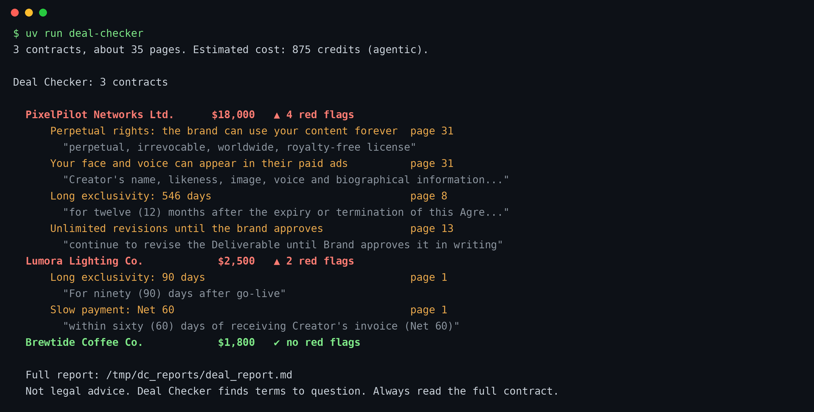
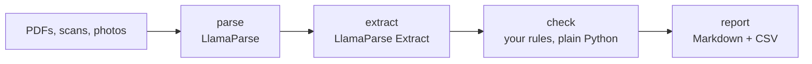

# Deal Checker

**Drop in brand deal contracts. Get red flags with page numbers.**

A small open-source workflow built on [LlamaParse](https://cloud.llamaindex.ai). It reads long PDFs, scans and photos, pulls out the terms that matter to creators, and flags the risky ones with the exact page and words.



## What it catches

- Perpetual rights, and use of your face or voice in paid ads, even when they hide in an exhibit
- Long exclusivity, including periods that continue after the deal ends
- Slow payment (later than Net 45)
- Unlimited revisions

The `sample_contracts/` folder has three fictional contracts. The 32-page PixelPilot agreement says "60 days" in its summary on page 2. Page 31 grants perpetual rights. Deal Checker finds both.

## Quickstart (5 minutes)

1. Install [uv](https://docs.astral.sh/uv/getting-started/installation/).
2. Get a free LlamaParse API key at [cloud.llamaindex.ai](https://cloud.llamaindex.ai). The free plan gives 10,000 credits every month.
3. Run:

```bash
cp .env.example .env     # then paste your key into .env
uv run deal-checker      # checks sample_contracts/
```

Check your own contracts:

```bash
uv run deal-checker ~/Downloads/brand-deals
```

EU account (your dashboard address is `cloud.eu.llamaindex.ai`)? Add this line to `.env`:
`LLAMA_CLOUD_BASE_URL=https://api.cloud.eu.llamaindex.ai`

## How it works



| File | Job |
|---|---|
| `src/deal_checker/schema.py` | The 10 questions we ask about every contract |
| `src/deal_checker/workflow.py` | parse, extract, check, report (LlamaIndex Workflows) |
| `src/deal_checker/rules.py` | Your red flag rules. Change the numbers. |
| `src/deal_checker/report.py` | Writes `reports/deal_report.md` and `reports/deals.csv` |
| `src/deal_checker/cli.py` | The `deal-checker` command and the cost estimate |

- The extract step reuses the parse job, so every page is parsed only once.
- Every flag carries the page number and the exact words, so you can check it yourself.
- One broken file does not stop the run. It shows up as an error line in the report.
- `reports/parsed/` keeps the Markdown that LlamaParse read, for your own review.

## Make it yours

Edit `src/deal_checker/rules.py`:

```python
MAX_PAYMENT_DAYS = 45
MAX_EXCLUSIVITY_DAYS = 30
MAX_REVISION_ROUNDS = 2
```

To check something new, add a field to `schema.py` and a rule to `rules.py`. The same pattern works for invoices, leases or job offers.

## Cost

Credits per page (parse + extract):

| Tier | Credits per page | The 3 samples (35 pages) |
|---|---|---|
| `cost_effective` | 8 | 280 |
| `agentic` (default) | 25 | 875 |
| `agentic_plus` | 60 | 2,100 |

```bash
uv run deal-checker --tier cost_effective
```

The command prints an estimate before it starts. Parsing the same file again within 48 hours uses the LlamaParse cache.

## Tests

```bash
uv run pytest
```

The tests run the whole workflow with a fake LlamaParse client. No key and no credits. GitHub Actions runs them on every push.

## Not legal advice

Deal Checker finds terms to question. It does not replace a lawyer or your own reading of the full contract. All sample contracts, brands and people in this repo are fictional.

## License

MIT
